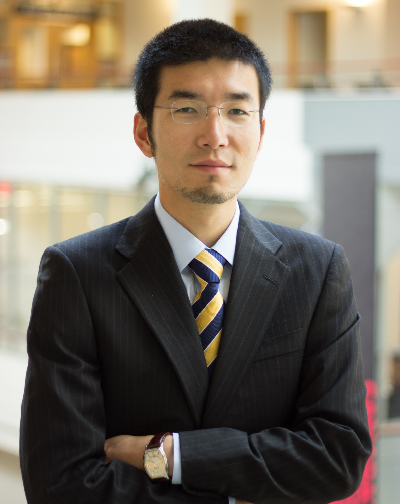

---
# You don't need to edit this file, it's empty on purpose.
# Edit theme's home layout instead if you wanna make some changes
# See: https://jekyllrb.com/docs/themes/#overriding-theme-defaults
layout: home
---
<!---
{:height="300px" }|  |  **Longyuan Du**   Ph.D. Candidate in Operations Management   Rotman School of Management   University of Toronto   105 St George St   Toronto, ON, M5S 3E6   [Longyuan.Du14@Rotman.Utoronto.ca](mailto:Longyuan.Du14@Rotman.Utoronto.ca)|
--->

<table width="120%">
<colgroup>
<col width="30%" />
<col width="70%" />
</colgroup>

<tbody>
<tr>
<td markdown="span">{:height="300px" }</td>
<td markdown="span"> **Longyuan Du**{: style=" font-size: 125%"}       Assistant Professor   Department of Business Analytics and Information Systems  School of Management, University of San Francisco    [ldu5@usfca.edu](mailto:ldu5@usfca.edu)
</td>
</tr>

</tbody>
</table>

 

I am an Assistant Professor in Business Analytics and Information Systems at the [School of Management](https://www.usfca.edu/management), [University of San Francisco](https://www.usfca.edu). In 2018 I received my Ph.D. in Operations Management at [Rotman School of Management](https://www.rotman.utoronto.ca/), [University of Toronto](https://www.utoronto.ca/). From 2012 to 2014, I worked as an operations research analyst at [4R Systems](http://4rsystems.com/), a retail analytics firm in Berwyn, PA. I received my master's degree in Civil Engineering from [University of Maryland, College Park](https://www.umd.edu/) in 2012, and my bachelor's degree in Mathematics from [Fudan University](http://www.fudan.edu.cn/en), Shanghai, China in 2010.
